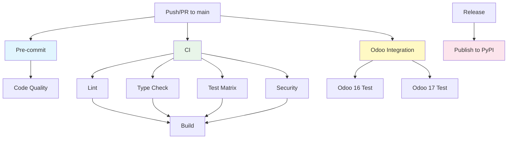

# GitHub Actions CI/CD Pipeline

This document describes the continuous integration and deployment workflows configured for the Odoo MCP Server project.

## Overview

Our CI/CD pipeline consists of 4 workflows:

1. **CI** - Main continuous integration
2. **Pre-commit** - Code quality checks
3. **Odoo Integration** - Integration tests with real Odoo instances
4. **Publish** - PyPI package publishing

## Workflows

### 1. CI Workflow (`.github/workflows/ci.yml`)

**Triggers:**

- Push to `main` branch
- Pull requests to `main` branch

**Jobs:**

#### Lint

- **Python Version:** 3.12
- **Checks:**
  - Black code formatting
  - isort import sorting
  - flake8 linting
  - bandit security scanning

#### Type Check

- **Python Version:** 3.12
- **Checks:**
  - mypy type checking with `types-requests`

#### Test

- **Python Versions:** 3.10, 3.11, 3.12 (matrix)
- **Checks:**
  - Python syntax validation
  - Module import tests
  - (Prepared for pytest when tests are added)

#### Security

- **Python Version:** 3.12
- **Checks:**
  - Hardcoded secrets detection
  - MCP security best practices
  - Import safety validation

#### Build

- **Python Version:** 3.12
- **Depends on:** lint, type-check, test, security
- **Steps:**
  - Build Python package
  - Validate package with twine
  - Upload build artifacts

**Artifacts:**

- `python-package-distributions` - Built wheel and source distribution

---

### 2. Pre-commit Workflow (`.github/workflows/pre-commit.yml`)

**Triggers:**

- Push to `main` branch
- Pull requests to `main` branch

**Job:**

- **Python Version:** 3.12
- **Steps:**
  - Run all pre-commit hooks
  - Includes: black, isort, autoflake, bandit, yaml/json/toml checks, secret detection

**Purpose:** Ensures code quality standards before merge

---

### 3. Odoo Integration Workflow (`.github/workflows/odoo-integration.yml`)

**Triggers:**

- Push to `main` branch
- Pull requests to `main` branch
- Manual dispatch (`workflow_dispatch`)

**Jobs:**

#### Test with Odoo 16

- **Services:**
  - PostgreSQL 15 (health checked)
- **Steps:**
  1. Pull `odoo:16` Docker image
  2. Start Odoo container (port 8069)
  3. Wait for Odoo initialization (max 120s)
  4. Create test database
  5. Test MCP server connection
  6. Validate basic operations (models, partners)
  7. Show logs on failure

#### Test with Odoo 17

- **Services:**
  - PostgreSQL 16 (health checked)
- **Steps:**
  1. Pull `odoo:17` Docker image
  2. Start Odoo container (port 8069)
  3. Wait for Odoo initialization (max 120s)
  4. Test MCP server connection
  5. Validate operations
  6. Show logs on failure

**Environment Variables:**

```bash
ODOO_URL=http://localhost:8069
ODOO_DB=odoo
ODOO_USERNAME=admin
ODOO_PASSWORD=admin
```

**Purpose:** Real integration testing with actual Odoo instances

---

### 4. Publish Workflow (`.github/workflows/publish.yml`)

**Triggers:**

- Release published
- Manual dispatch (`workflow_dispatch`)

**Job:**

- **Python Version:** 3.12
- **Permissions:**
  - `contents: read`
  - `id-token: write` (for trusted publishing)
- **Steps:**
  1. Build package
  2. Validate with twine
  3. Publish to PyPI (using `PYPI_API_TOKEN` secret)

**Required Secret:**

- `PYPI_API_TOKEN` - PyPI API token for package publishing

**Purpose:** Automated PyPI releases

---

## CI/CD Flow



## Status Badges

Add these badges to your README:

```markdown
[](https://github.com/itbrasil-odoo/mcp-odoo/actions/workflows/ci.yml)
[](https://github.com/itbrasil-odoo/mcp-odoo/actions/workflows/pre-commit.yml)
[](https://github.com/itbrasil-odoo/mcp-odoo/actions/workflows/odoo-integration.yml)
```

## Local Testing

### Run CI checks locally:

```bash
# Pre-commit hooks
pre-commit run --all-files

# Lint
black --check .
isort --check-only .
flake8 app.py simple_server.py src/

# Security
bandit -r src/ -ll
python scripts/check_secrets.py
python scripts/check_mcp_security.py
python scripts/check_import_security.py

# Type check
mypy src/ --ignore-missing-imports

# Build
python -m build
twine check dist/*
```

### Run Odoo integration tests locally:

```bash
# Start PostgreSQL
docker run -d --name postgres \
  -e POSTGRES_DB=odoo \
  -e POSTGRES_USER=odoo \
  -e POSTGRES_PASSWORD=odoo \
  -p 5432:5432 \
  postgres:16

# Start Odoo 17
docker run -d --name odoo17 \
  --link postgres:db \
  -p 8069:8069 \
  -e HOST=db \
  odoo:17

# Test connection
export ODOO_URL=http://localhost:8069
export ODOO_DB=odoo
export ODOO_USERNAME=admin
export ODOO_PASSWORD=admin

python -c "
import sys
sys.path.insert(0, 'src')
from odoo_mcp.odoo_client import get_odoo_client
client = get_odoo_client()
print(f'✅ Connected! User ID: {client.uid}')
"
```

## Troubleshooting

### CI Failures

**Lint failures:**

- Run `pre-commit run --all-files` locally
- Fix issues reported by black, isort, flake8

**Type check failures:**

- Run `mypy src/` locally
- Add type hints or ignore with `# type: ignore`

**Security failures:**

- Check `scripts/check_*.py` output
- Remove hardcoded secrets
- Fix unsafe patterns

### Odoo Integration Failures

**Timeout waiting for Odoo:**

- Check Docker logs: `docker logs odoo16`
- Increase timeout in workflow (default: 120s)

**Connection refused:**

- Ensure PostgreSQL service is healthy
- Check network configuration

**Authentication failed:**

- Verify default credentials (admin/admin)
- Check database initialization

## Contributing

See [CONTRIBUTING.md](../CONTRIBUTING.md) for development guidelines and how to run tests locally.

## Questions?

Open an issue on GitHub for questions or discussions about the CI/CD pipeline.
